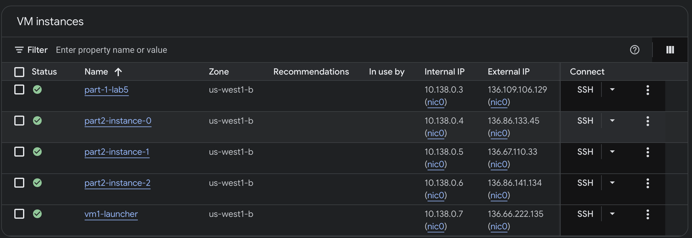

#Results
Here is a screenshot of creating the VM: 

# lab5-programmable-cloud

An assignment demonstrating programmatic interfaces to cloud computing software.

## Overview

The goal of this assignment is to understand how programmatic interfaces can be used to construct, configure, and manage applications running in a cloud environment.

This assignment consists of three parts:

1. **Create and configure a virtual machine**

   You will write a program that:

   * Creates a virtual machine (VM) instance.
   * Configures the VM.
   * Installs a software application from a `git` repository.
   * Modifies firewall rules so that the application is accessible.
   * Instructs the user to visit a specific web page to use the application.

2. **Create an image from a VM**

   You will write another program that:

   * Creates a snapshot of the VM from Part 1.
   * Uses the snapshot to create a custom [VM image](https://cloud.google.com/compute/docs/images/create-delete-deprecate-private-images#before-you-begin).
   * Creates three new VM instances using the image.
   * Measures the time required to create each instance.

   This part demonstrates how images can be used to quickly reproduce a configured computing environment.

3. **Use a service account to create a VM**

   You will create and use a [service account](https://cloud.google.com/iam/docs/understanding-service-accounts) to provide credentials to a program running on a VM.

   Your program will use those credentials to create a VM, and that VM will then create another VM. In other words, you will deploy the functionality from Part 1 inside another VM.

   A service account allows an application to "act as" an identity with a specific set of Google Cloud permissions. By granting only the permissions required by an application, service accounts provide a way to control what that application is allowed to do.

   Google Cloud VM instances can also have a default service account that allows applications running on the instance to access certain Google Cloud services. For this assignment, however, you will [create your own service account and explicitly use it in your Python application](https://cloud.google.com/compute/docs/access#access_control_for_apps_running_on_vm_instances).

## Prerequisites

You will need:

* A Google Cloud project with access to Compute Engine.
* Python 3.
* The Google Cloud SDK (`gcloud`), either installed on your own computer or available through the Google Cloud Console.
* A GitHub account and access to the class repository.

We will use the [Google Cloud Python APIs](https://cloud.google.com/compute/docs/tutorials/python-guide) to write the programs for this assignment.

You can either run your programs on your own computer, provided you can install and configure the Google Cloud SDK, or you can use the Google Cloud Console.

## GitHub Access

Part 1 requires you to install software from a `git` repository on your VM.

It can be difficult to add and manage additional `.ssh` keys when working with a VM through the Google Cloud Console. You have two options for accessing your class repository:

* **SSH (recommended):** Add the public SSH key you create within the console to your GitHub account.
* **HTTPS:** Use the HTTPS repository URL together with a GitHub Personal Access Token (PAT). See the GitHub documentation for [creating a personal access token](https://docs.github.com/en/authentication/keeping-your-account-and-data-secure/creating-a-personal-access-token) and [using HTTPS with a PAT](https://help.github.com/en/articles/which-remote-url-should-i-use).

Do not commit your GitHub credentials or personal access tokens to your assignment repository.

## Details

You should write your code using the template files provided in each subdirectory. Each part contains a `README.md` file with additional instructions.

I recommend starting with the tutorial referenced in `part1/README.md`.

For each part, I recommend the following workflow:

1. **Perform the task manually using the Google Cloud Console.**
2. **Identify the Google Cloud API operations corresponding to each step.**
3. **Write Python code that performs the same operations programmatically.**
4. **Run your program and verify that it produces the expected result.**

This approach will help you understand both what the Google Cloud services are doing and how those operations can be automated through APIs.

## Google Cloud APIs

You will make extensive use of the [Google Cloud Compute Engine REST APIs](https://cloud.google.com/compute/docs/reference/rest/v1/).

The APIs are organized by resource and operation. For example, the `instances` API contains operations for creating, configuring, and managing VM instances.

The Google Cloud API documentation generally includes examples showing how to perform operations programmatically. Many API operations allow you to specify configuration details using a Python `dict`, which corresponds closely to the JSON representation used by the REST API.

As you work through the assignment, pay particular attention to the relationship between:

**Google Cloud Console → REST API → Python API client**

The Console provides a graphical interface for performing an operation, while your Python program will perform the corresponding operation through the Google Cloud API.

## Learning Objectives

After completing this assignment, you should be able to:

* Use a cloud API to programmatically create and configure VM instances.
* Understand the relationship between cloud-console operations and API calls.
* Install and configure software on a VM programmatically.
* Configure network/firewall access for a cloud application.
* Create snapshots and VM images.
* Use images to rapidly create multiple VM instances.
* Measure and compare cloud provisioning times.
* Create and use service accounts.
* Understand how IAM permissions control what an application running in the cloud can do.
* Use one cloud-hosted application to programmatically create additional cloud resources.
