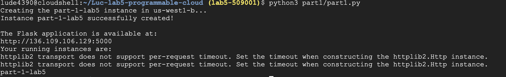

# Results
Here is a screenshot of creating the VM: 

# Part One - Program to Create a VM and install an Application

In this part, you're going to write a simple program to create a VM install the [flask tutorial application](https://github.com/cu-csci-4253-datacenter/flask-tutorial). In later labs, we'll be using [Flask](https://palletsprojects.com/p/flask/) to write a simple REST interface.

Before starting this lab, [you should go through every step of the Google cloud Python tutorial](https://cloud.google.com/compute/docs/tutorials/python-guide). It is very important that you run the command
```
gcloud auth application-default login
```
if you're using your laptop. This command authenticates you to Google cloud and stores the credentials in your home directory. This is done automatically if you're using Google Cloud.

You should [clone the programming tutorial from github](https://github.com/GoogleCloudPlatform/python-docs-samples) and run the code examples in `compute/api/create_instance.py`. You will be able to borrow liberally from this code for your assignment (giving proper attribution, of course).

The tutorial goes through the steps of creating an instance. That instance is created using a `debian-9` image. As part of the startup code for that image, the `startup_script` shell script is executed; that script retrieves an image (specified by the program), modifies it and places it in a Google storage `bucket`.

Our program will be similar:
* You will create an image (the `f1-micro` image is "free") in the "us-west1-b" [zone](https://cloud.google.com/compute/docs/regions-zones/). Note that the `f1-micro` instance is very slow; you might want to use a large instance type like an 'e2-medium' while you're developing your code -- but remember to kill it when done or you will spend all your credits.
* You should use the `ubuntu-2204-lts` images from the `ubuntu-os-cloud` "family" of public images. This will start with a "Bionic Beaver" release. You can determine the avaialable versions using
```
gcloud compute images list | grep -i ubuntu
```
* You will use the `default` network and use the same `ONE_TO_ONE_NAT` option in the example
* In your startup script, you should `git clone` the [flask tutorial git repo](https://github.com/cu-csci-4253-datacenter/flask-tutorial) and then install the `flaskr` application (see below). This is a public repo and you don't need a key or password to access it.
* You should create a [firewall rule](https://cloud.google.com/vpc/docs/firewalls) called `allow-5000` using the [firewall API](https://cloud.google.com/compute/docs/reference/rest/v1/firewalls). You should allow TCP port `5000` to be accessed from anywhere (e.g. `0.0.0.0/0`). Note that you only need to create the firewall rule once, but you should do so from your code. You can check if the firewall rule exists by name using the [API](https://cloud.google.com/compute/docs/reference/rest/v1/firewalls/list). You should have the firewall rule use a "network tag" so that it applies only to instances with that tag. You can name that tag `allow-5000` as well.
* Then, apply the network tag `allow-5000` to your VM instance using [setTags](https://cloud.google.com/compute/docs/reference/rest/v1/instances/setTags).
* You should retrieve the public / external IP address from the instance information and invite the user to visit the appropriate url (e.g. http://35.197.100.174:5000 or whatever your IP address is)

To install the example flask application, you will need to install `python3` and `python3-pip`. Something like this should work:
```
sudo apt-get update
sudo apt-get install -y python3 python3-pip git
git clone https://github.com/cu-csci-4253-datacenter/flask-tutorial
cd flask-tutorial
sudo python3 setup.py install
sudo pip3 install -e .
```
should build and install the software. To then run the application, you should specify:
```
export FLASK_APP=flaskr
flask init-db
nohup flask run -h 0.0.0.0 &
```
This last line starts the `flask` application and `nohup` insures that it continues to run after the `startup_script.sh` finishes execution.

## Recommendations

You should first perform each step manually using the google console.

When your startup script runs, it will run in the root directory (`/`) by default. You probably want to create a subdirectory somewhere and `cd` to that.

If you're having trouble figuring out why something failed, you can get some debugging output in `/var/log/syslog` - you'll need to ssh to the VM. There will be a lot of extra info there but search for keywords like `flask` to find what you're looking for.

If you're uncertain how to configure a certain option (e.g. a network tag or somesuch), you can configure it using the GUI and then run
```
gcloud compute instances list --format=json
```
to get a complete dump of the instance configuration details. This can help you narrow down what part of the API documentation to consult or determine valid values.

# Part One — Program to Create a VM and Install an Application

In this part, you will write a Python program that creates a virtual machine (VM) and installs the [Flask tutorial application](https://github.com/cu-csci-4253-datacenter/flask-tutorial).

In later labs, we will use [Flask](https://palletsprojects.com/p/flask/) to build a simple REST interface.

The goal of this assignment is not simply to learn how to create a VM. Instead, you will learn how to use the Google Cloud APIs to automate a sequence of operations that you could otherwise perform manually through the Google Cloud Console.

## Before You Begin

Before starting this lab, you should work through **every step** of the [Google Cloud Python tutorial](https://cloud.google.com/compute/docs/tutorials/python-guide).

If you are using your own computer, you will need to authenticate your Python programs with Google Cloud. Run:

```bash
gcloud auth application-default login
```

This command authenticates you to Google Cloud and stores Application Default Credentials in your home directory. Python programs that use Google Cloud client libraries can then use these credentials to authenticate API requests.

If you are running your program on a Google Cloud VM, Google Cloud can provide credentials to the VM through its attached service account. You generally do not need to run `gcloud auth application-default login` on the VM.

### Get the Example Code

You should clone the Google Cloud Python examples repository:

https://github.com/GoogleCloudPlatform/python-docs-samples

Look at and run the examples in:

```text
compute/api/create_instance.py
```

You will be able to borrow from this code for your assignment. You should understand the code that you use and retain appropriate attribution for code adapted from the Google examples.

## What You Will Build

Your program will perform the following sequence of operations:

1. Create a VM instance.
2. Configure the VM with a startup script.
3. Have the startup script install and configure the Flask application.
4. Create a firewall rule allowing access to the application.
5. Apply a network tag to the VM so that the firewall rule applies to it.
6. Retrieve the VM's external IP address.
7. Print a URL that the user can visit to access the Flask application.

The important idea is that **your Python program should perform these operations through the Google Cloud APIs rather than requiring the user to perform them manually in the Google Cloud Console.**

## VM Configuration

Your program should create the following VM:

### Zone

Create the VM in the `us-west1-b` [zone](https://cloud.google.com/compute/docs/regions-zones/).

### Machine Type

For your final program, use a cheap machine type, e.g. `f1-micro` or `e2` family.

**Remember to delete larger or otherwise unnecessary VMs when you are finished with them.**

### Operating System

Use an ubuntu image family, e.g. `ubuntu-2204-lts` or `ubuntu-2604-lts-arm` from the `ubuntu-os-cloud` image project.

Using an image family means that you do not need to hard-code a particular image version. Google Cloud can select the current image associated with the family.

You can see available Ubuntu images with:

```bash
gcloud compute images list | grep -i ubuntu
```

You should use the image family rather than selecting a specific image name.

### Network

Use the `default` network.

Configure the VM's network interface with an external IP address using the `ONE_TO_ONE_NAT` access configuration, as demonstrated in the Google Cloud Python tutorial.

Your application must be accessible from the Internet using the VM's external IP address.

## Startup Script

Your VM should use a startup script to install and start the Flask application.

The startup script should:

1. Update the Ubuntu package information.
2. Install Python 3, `pip`, and `git`.
3. Clone the Flask tutorial repository.
4. Install the `flaskr` application.
5. Initialize the application's database.
6. Start the Flask application.

The Flask tutorial repository is public, so you do not need an SSH key or password to clone it:

```text
https://github.com/cu-csci-4253-datacenter/flask-tutorial
```

For example, the basic installation commands are:

```bash
sudo apt-get update
sudo apt-get install -y python3 python3-pip git

git clone https://github.com/cu-csci-4253-datacenter/flask-tutorial

cd flask-tutorial

sudo python3 setup.py install
sudo pip3 install -e .
```

After installing the application, configure and initialize it:

```bash
export FLASK_APP=flaskr
flask init-db
```

Then start the application:

```bash
nohup flask run -h 0.0.0.0 &
```

The `-h 0.0.0.0` option tells Flask to listen on all network interfaces rather than only on the VM's local loopback interface.

The `nohup` command allows the Flask process to continue running after the startup script finishes.

Flask's development server listens on TCP port `5000` by default.

## Firewall Rule

Your program must create a [Google Cloud firewall rule](https://cloud.google.com/vpc/docs/firewalls) named:

```text
allow-5000
```

The firewall rule should:

- Allow TCP traffic on port `5000`.
- Allow traffic from `0.0.0.0/0`.
- Use the `allow-5000` network tag to identify the VM instances to which the rule applies.

The firewall rule is a **VPC-level resource**. You do not create a separate firewall rule for each VM. Instead, the rule uses a network tag to determine which VMs the rule applies to.

In this assignment, the firewall rule should effectively mean:

> Allow TCP port 5000 from the Internet to instances tagged `allow-5000`.

Using a network tag is important because it prevents this rule from automatically exposing port 5000 on every VM in the network.

### Check Whether the Rule Already Exists

Your program should not blindly attempt to create the firewall rule every time it runs.

First, use the [firewall API](https://cloud.google.com/compute/docs/reference/rest/v1/firewalls/list) to determine whether a firewall rule named `allow-5000` already exists.

If the rule does not exist, create it using the [firewall API](https://cloud.google.com/compute/docs/reference/rest/v1/firewalls).

You only need to create the firewall rule once.

## Network Tag

After creating the VM, apply the network tag:

```text
allow-5000
```

to the VM instance.

Use the [`setTags`](https://cloud.google.com/compute/docs/reference/rest/v1/instances/setTags) API operation to do this.

The resulting relationship should look like:

```text
Firewall rule: allow-5000
        |
        | applies to instances with tag
        v
Network tag: allow-5000
        |
        v
Your VM instance
```

## External IP Address

After the VM has been created, retrieve its external IP address from the instance information returned by the Compute Engine API.

Your program should print a message telling the user where to access the application.

For example:

```text
The Flask application is available at:

http://35.197.100.174:5000
```

Do **not** hard-code an IP address. The external IP address will be different for each VM.

The user should be able to copy the URL into a web browser and access the Flask application.

## Requirements

Your completed program must:

- [ ] Create a VM in `us-west1-b`.
- [ ] Use the `f1-micro` machine type for the final version.
- [ ] Use the `ubuntu-2204-lts` image family from `ubuntu-os-cloud`.
- [ ] Use the `default` network.
- [ ] Configure the VM with an external IP address using `ONE_TO_ONE_NAT`.
- [ ] Provide a startup script that installs the required software.
- [ ] Clone the Flask tutorial repository from GitHub.
- [ ] Install the `flaskr` application.
- [ ] Initialize the Flask application's database.
- [ ] Start the Flask application on port 5000.
- [ ] Check whether the `allow-5000` firewall rule already exists.
- [ ] Create the `allow-5000` firewall rule if necessary.
- [ ] Configure the firewall rule to allow TCP port 5000 from `0.0.0.0/0`.
- [ ] Configure the firewall rule to target instances with the `allow-5000` network tag.
- [ ] Apply the `allow-5000` network tag to the VM using `setTags`.
- [ ] Retrieve the VM's external IP address programmatically.
- [ ] Print a URL that the user can use to access the Flask application.

## Recommendations

### Do It Manually First

Before writing your Python program, perform each operation manually using the Google Cloud Console.

For example:

1. Create a VM with the desired configuration.
2. Connect to the VM.
3. Install the Flask application.
4. Create the firewall rule.
5. Add the network tag.
6. Verify that the application is accessible from your browser.

Once you understand how the manual process works, write Python code that performs the same operations.

This is an important part of the assignment. You are learning to translate operations performed through a graphical interface into operations performed through a cloud API.

### Understand the API Documentation

You will make extensive use of the [Google Cloud Compute Engine REST API](https://cloud.google.com/compute/docs/reference/rest/v1/).

The API is organized around cloud resources and operations. For example, the `instances` API contains operations for creating and managing VM instances.

Many Google Cloud API operations allow you to specify configuration information using a Python `dict`. These dictionaries correspond closely to the JSON representations used by the REST API.

When you are unsure how to configure an API request, look at:

1. The Google Cloud Console configuration.
2. The corresponding REST API documentation.
3. The Python example provided in the API documentation.

### Look at the Instance Configuration

If you are uncertain how to configure a particular option—for example, a network tag—you can first configure the option manually using the Google Cloud Console.

You can then inspect the resulting VM configuration with:

```bash
gcloud compute instances list --format=json
```

This produces a detailed JSON representation of the instances in your project. Looking at this output can help you determine which fields you need to specify in your API request.

### Debugging Startup Scripts

Startup scripts can be difficult to debug because they run automatically when the VM boots.

If something goes wrong, SSH into the VM and examine:

```text
/var/log/syslog
```

There will be a lot of unrelated information in this file, so search for terms such as:

```text
flask
startup
git
apt
```

You can also check whether the expected software was actually installed and whether the Flask process is running.

For example:

```bash
ps aux | grep flask
```

and:

```bash
python3 --version
```

If your startup script fails partway through, remember that the commands after the failure may never have been executed.

### Be Careful With Cloud Resources

Cloud resources can cost money.

During development, you may use a larger VM to make testing faster, but **delete the VM when you are finished**.

Also remember that resources such as firewall rules, disks, snapshots, and images can persist after you delete a VM. Check your project when you are finished and remove resources that you no longer need.

## Conceptual Goal

At the end of this exercise, you should understand the difference between:

```text
Manual operation:

Google Cloud Console
        |
        v
Google Cloud service
```

and:

```text
Programmatic operation:

Python program
        |
        v
Google Cloud API
        |
        v
Google Cloud service
```

The second approach allows cloud resources and applications to be created and configured automatically, repeatably, and as part of a larger software system.
